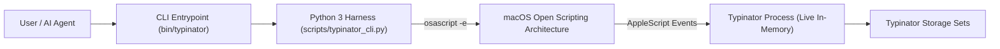

# System Architecture Map - 26.09.06-typinator-cli

> One-page app/system map. Read this before database/schema spelunking, API
> tracing, feature planning, or architecture-impacting edits. Keep it concise
> enough that a future agent can understand what this app is without
> reverse-engineering tables, migrations, logs, or dashboards.

## App Summary

- What this app does: High-performance command-line interface & automation harness for Typinator text expansion on macOS.
- Primary users: macOS power users, command-line developers, autonomous AI agents.
- Core jobs: Sub-second rule search (<0.4s for 4,400+ rules), live in-memory updates, batch JSON export/import, safety auditing for invisible control characters (\u2028), toggle rule sets.
- Out of scope: GUI management (Typinator owns the UI), non-macOS platforms (relies on macOS OSA).
- Current phase: Production (v1.1.0)
- last_verified: 2026-09-06

## System Diagram

## Module Map

| Module / Area | Owns | Reads | Writes | Public Contract | Source Paths |
| --- | --- | --- | --- | --- | --- |
| CLI Parser & Dispatch | Argument parsing and subcommands | `sys.argv` | Terminal stdout / JSON | `main()` | `scripts/typinator_cli.py` |
| OSA IPC Bridge | AppleScript execution & string escaping | AppleScript templates | `osascript` subprocess | `run_applescript()`, `escape_as()` | `scripts/typinator_cli.py` |
| Bulk Rule Table Streaming | Sub-second high-speed bulk query | `rule table of aSet` | Parsed rule dictionaries | `search_rules()` | `scripts/typinator_cli.py` |
| Mutation & Lifecycle | Single-rule additions, updates, toggles, deletions | Live rule state | Typinator in-memory objects | `add_rule()`, `set_rule_expansion()`, `delete_rule()`, `toggle_set()` | `scripts/typinator_cli.py` |
| Audit & Hygiene | Detecting invisible Unicode (\u2028) & trigger collisions | Rule expansions & triggers | Cleaned expansions | `audit_rules()` | `scripts/typinator_cli.py` |
| Backup & Migration | JSON export and import with overwrite support | JSON payload / live rules | File / Typinator rules | `export_rules()`, `import_rules()` | `scripts/typinator_cli.py` |

## Data And Storage

| Store / Table / Collection | Owns | Key Entities | Producer | Consumer | Source Of Truth | Notes |
| --- | --- | --- | --- | --- | --- | --- |
| Typinator Application Memory | Active expansion rules and rule sets | Rule sets, Rules, Expansions, IDs | User, `typinator-cli` | Typinator system daemon, `typinator-cli` | Typinator Process | AppleScript is the truth reader/writer |
| JSON Backup Files | Exported portable rule sets | Rules, timestamps, set metadata | `export` command | `import` command | Backup snapshot | Portable migration format |

## Integrations And External Services

| Service | Purpose | Auth / Secret Route | Owner Module | Failure Mode | Verification |
| --- | --- | --- | --- | --- | --- |
| Typinator Application | Target text expander | Local GUI permissions (Accessibility/Automation) | OSA IPC Bridge | Exit 1 with informative error (e.g. -600 not running) | `typinator status` (last_verified: 2026-09-06) |
| GitHub Repository | Source control & community distribution | GitHub SSH / HTTPS (`vecyang1/typinator-cli`) | Git | Offline / remote rejected | `gh repo view vecyang1/typinator-cli` |

## Runtime And Deployment

| Surface | Runtime | Entry Command / URL | Config Source | Health Check | Owner |
| --- | --- | --- | --- | --- | --- |
| Local CLI | Python 3.8+ (zero dependencies) | `typinator [subcommand]` or `bin/typinator` | None (pure CLI) | `typinator status` | Core Repo |
| Global PATH | Symlink | `~/.local/bin/typinator` | Symlink to `bin/typinator` | `which typinator` | Host environment |

## Update Triggers

Update this file in the same work block when any of these change:

- App purpose, user type, or core workflow.
- Module boundaries, exported APIs, shared schemas, or cross-module contracts.
- Database tables, migrations, storage buckets, queues, scheduled jobs, or caches.
- External integrations, auth/payment/AI providers, webhook routes, or secret names.
- Runtime, deployment path, health check, or environment/config ownership.

Do not reverse-engineer the app by crawling databases first. Read this file
before database/schema spelunking, then update it if the live system proves the
map is stale.

## Open Questions

- TBD
